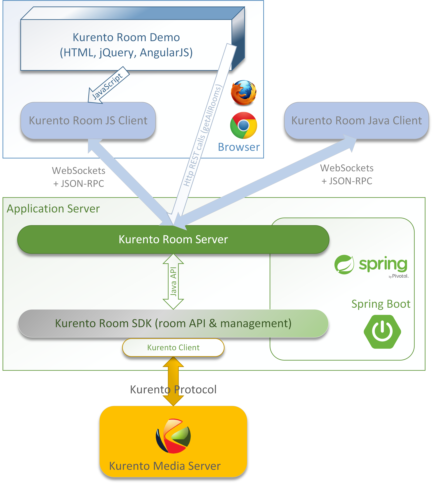

%%%%%%%%%%%
Description
%%%%%%%%%%%

This project is a framework that was developed using Kurento Media Server and 
WebRTC. Its main goal is to aid programmers when implementing applications for 
multimedia group communications.  
 
A demonstration application is available that makes use of this API to enable 
users to simultaneously establish multiple connections to other users connected 
to the same session or room.

The core module is the Room SDK but the developers can pick whatever component
they need from the framework in order to build their application.

For example, some might need only small modifications on the client side but
others will want to inject their logic on server side and might even have to
modify the SDK.

   *Kurento Room components*