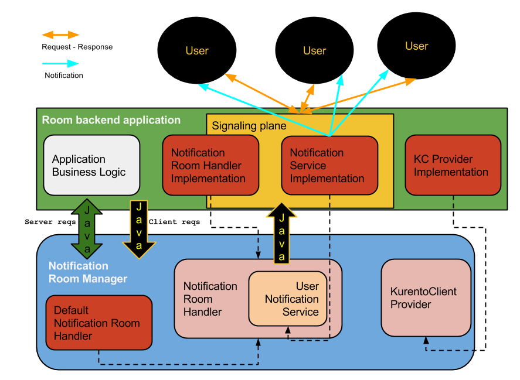

%%%%%%%%%%%%%%%%%%%%
Java API Integration
%%%%%%%%%%%%%%%%%%%%

The Kurento room manager represents an SDK for any developer that wants to
implement the Room server-side application. They can build their application on
top of the manager's Java API and implement their desired business logic
without having to consider room or media-specific details.

We provide two flavors of room manager that present the same methods but with
different signatures:

- a straightforward implementation whose methods are executed in a synchronous
  manner - ``RoomManager``
- a notification room manager, whose methods would trigger responses or
  notifications that are to be sent back to the remote parties (especially in
  the case of client-originated requests) - ``NotificationRoomManager``

The entities that are controlled by these APIs are the following:

- **rooms** - virtual groups of peers, an user can be part of only one  room
  at a time. To identify them we use their names.
- **participants** - virtual representation of a user. The application must
  provide a string representation of the user at communication (or transport)
  level that should suffice to uniquely identify the participant (the parameter
  ``participantId``).

RoomManager
===========

There are several requirements for anyone willing to instantiate a regular room
manager, and they are to provide implementations for:

- a room handler in charge of events triggered by internal media objects
- a Kurento Client manager that will be used to obtain instances of Kurento Client

For client-originated requests, the application is required to inform the
remote parties of the outcome of executing the requests, such as informing all
participants in a room when one of them has requested to publish her media.

There is another type of methods that attend to application-originated requests
(or business logic), in this case the application if free to interpret the
result and to act upon it.

Events - RoomHandler
====================

In order to act upon events raised by media objects, such as new ICE Candidates gathered or media errors, 
the application has to provide an event handler. Generally speaking, these 
are user-orientated events, so the application should notify the corresponding users.

Room and RoomHandler relations
------------------------------

The following is a table detailing the server events that will resort to methods from RoomHandler.

+------------------------+---------------------+
| **Events**             | **RoomHandler**     |
+------------------------+---------------------+
| gathered ICE candidate | onSendIceCandidate  |
+------------------------+---------------------+
| pipeline error         | onPipelineError     |
+------------------------+---------------------+
| media element error    | onMediaElementError |
+------------------------+---------------------+

Notifications design - the NotificationRoomManager
==================================================

Once again, there are two requirements for anyone willing to instantiate a
notification room manager, and they are to provide implementations for:

 - a communication interface that can send messages or notifications back  to
   the application's end users AND/OR a notification room event handler that
   will take the control over the notifications' lifecycle
 - a Kurento Client manager that will be used to obtain concrete instances
   of Kurento Client

The room event handler has been designed to provide feedback to the application
with the result obtained from processing a user's request.

The notification managing API considers two different types of methods:

 - **server domain** - consists of methods designed to be used in the
   implementation of the application's logic tier and the integration with the
   room SDK. The execution of these methods will be performed synchronously.
   They can be seen as helper or administration methods and expose a direct
   control over the rooms.
 - **client domain** - methods invoked as a result of incoming user
   requests, they implement the room specification for the client endpoints.
   They could execute asynchronously and the caller should not expect a result,
   but use the response handler if it's required to further analyze and process
   the client's request.

Notifications design - UserNotificationService
==============================================

This specification was planned so that the room manager could send
notifications or responses back to the remote peers whilst remaining isolated
from the transport or communications layers. The notification API is used by
the our implementation of the ``NotificationRoomHandler`` (the class
``DefaultNotificationRoomHandler``).

The API's methods were defined based on the protocol JSON-RPC and  its messages
format. It is expected but not required for the client-server communications to
use this protocol.

It is left for the integrator to provide an implementation for this API.

If the developer chooses another mechanism to communicate with the client,  they
will have to use their own implementation of ``NotificationRoomHandler`` which
will completely decouple the communication details from the room API.

Notifications design - NotificationRoomHandler
==============================================

Through this interface, the room API passes the execution result of client
primitives to the application and from there to the clients. It's the
application's duty to respect this contract. These methods all return ``void``.

Several of the methods will be invoked as a result of things happening outside
of a user request scope: room closed, user evicted and the ones inherited from
the ``RoomHandler`` interface.

NotificationRoomManager and NotificationRoomHandler relations
-------------------------------------------------------------

The following is a table detailing the methods from the
``NotificationRoomManager``  that will resort to methods from
``NotificationRoomHandler`` (also inherited methods).

+---------------------------------------+-----------------------------+
| **NotificationRoomManager**           | **NotificationRoomHandler** |
+---------------------------------------+-----------------------------+
| joinRoom                              | onParticipantJoined         |
+---------------------------------------+-----------------------------+
| leaveRoom                             | onParticipantLeft           |
+---------------------------------------+-----------------------------+
| publishMedia                          | onPublishMedia              |
+---------------------------------------+-----------------------------+
| unpublishMedia                        | onUnpublishMedia            |
+---------------------------------------+-----------------------------+
| subscribe                             | onSubscribe                 |
+---------------------------------------+-----------------------------+
| unsubscribe                           | onUnsubscribe               |
+---------------------------------------+-----------------------------+
| sendMessage                           | onSendMessage               |
+---------------------------------------+-----------------------------+
| onIceCandidate                        | onRecvIceCandidate          |
+---------------------------------------+-----------------------------+
| close room (Server action)            | onRoomClosed                |
+---------------------------------------+-----------------------------+
| evict participant (Server action)     | onParticipantEvicted        |
+---------------------------------------+-----------------------------+
| gathered ICE candidate (Server event) | onSendIceCandidate          |
+---------------------------------------+-----------------------------+
| pipeline error (Server event)         | onPipelineError             |
+---------------------------------------+-----------------------------+
| media element error (Server event)    | onParticipantMediaError     |
+---------------------------------------+-----------------------------+

KurentoClientProvider
---------------------

This service interface was designed so that the room manager could  obtain a
Kurento Client instance at any time, without requiring knowledge about the
placement of the KMS instances.

It is left for the integrator to provide an implementation for this API.

POJOs
-----

- ``UserParticipant`` - is a class that links the  participant's identifier
  with her user name and the if the user is currently streaming media.
- ``ParticipantRequest`` - is a class that links  participant's identifier
  with a request id (optional identifier of the request at the communications
  level, included when responding back to the client; is nullable and will be
  copied as is). Used in the notification variant of the RoomManager.
- ``RoomException`` - runtime exception wrapper, includes:

   - ``code`` - Number that indicates the error type that occurred
   - ``message`` - String providing a short description of the error

Room SDK integration diagram (with notifications)
=================================================

   *Room SDK integration diagram*